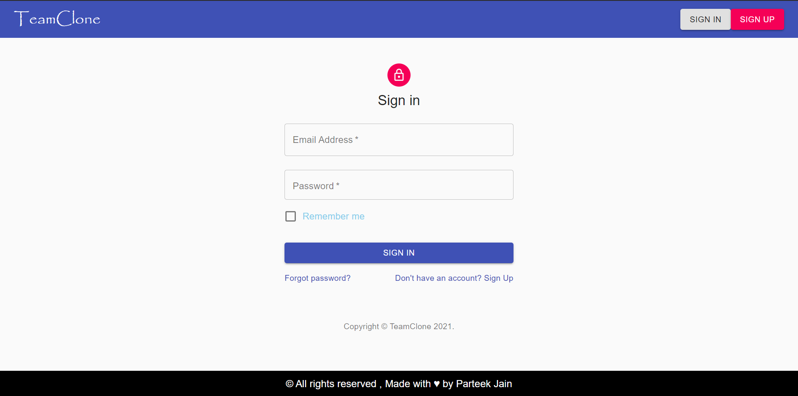

# **Welcome to Teams Video chat application** 

This is a video calling web application where users can call other user and will also have the capabiltiy to turn off their mic and video. There is also real time chat functionality. 

**_Project Link_** : https://vc-app93.herokuapp.com/
 
**_Demo Link_** : https://www.youtube.com/watch?v=yw4__juEvqc

## Features and Functionalities 😀
- Group video call , also possible in different network
- Audio/ Video controls 
- Join video call with a code
- Chat in real-time
- Chat Notifications
- User authentication 
- Password encryption  
- Notification alert sound
- Simple and intuitive UI

## Tech Stack 
- NodeJs
- MongoDb
- React 
- Socket-io

## Modules and Libraries 
- PeerJs : to establish peer to peer connection
- Bcrypt : to encrypt password
- JsonWebtoken : to store cookies
- Material-Ui : for frontened components
- Snackbar : for notification alerts 
- UIFX : to embed notification sounds

## How to start
1. Open the web application [Vc-app](https://vc-app93.herokuapp.com/)
2. Sign in using your account , if you don't have any account sign up first  (demo account : shaan@gmail.com  , pwd : shaan ) 
3. Create a new room 
4. Send roomId of the room from URL to your friend 
5. Ask your friend to join the room using that roomId 

> Now enjoy wonderful video conversation 
> Feel free to give your feedback on Email : parteekjain90340@gmail.com

## How to run locally 
1. Clone this repository 
2. move to root folder `cd TeamsClone`
3. run command `npm install` , make ensure nodeJs is already installed 
4. wait until step 3 completes
5. change directory to client `cd client`
6. run command `npm install`

## Application ScreenShots 

### Homepage 
   
   
### Sign In page 
    
   
### Sign Up page 
    
   
### Group Video Call
    
  
### Chat 
   

